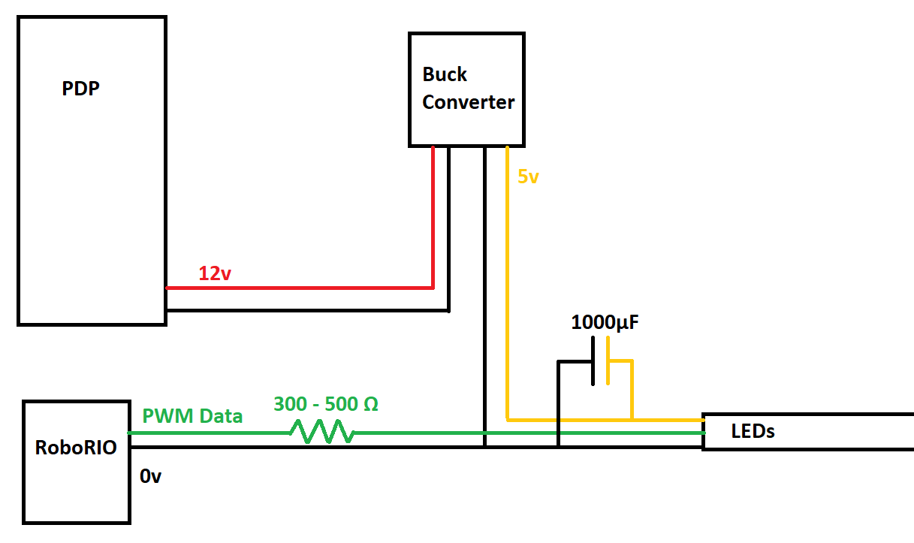
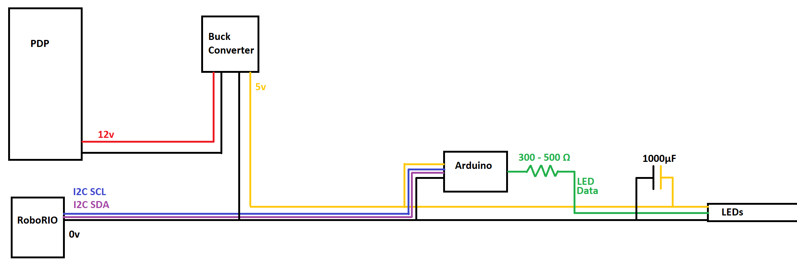

# Hardware

## Choosing LEDs
This library is intended for use with individually addressable WS2812 or SK6812 LEDs,
as found in the [Adafruit NeoPixels](https://www.adafruit.com/product/1138). Animations
were designed with LED strips in mind, however the library could likely be adapted to
work with other layouts, such as LED panels.

## Power Requirements
LEDs can be very bright, and thus can use a lot of power. Check the power rating
of your chosen LEDs, however it is very likely that it surpasses the 5V/2A
maximum of the VRM. You'll likely have to purchase a high power buck converter and use
one of the 20A or 40A railings from the PDP. Make sure the converter can handle
the maximum power your LEDs will be using. Something like [this](https://www.amazon.com/Aweking-Waterproof-Converter-Regulator-Transformer/dp/B06WVG9KL6)
ought to suffice.

## ESD Issues
Every Addressable LED contains a microchip, allowing it to be addressable. These
microchips are fairly voltage sensitive, and can be easily killed by ESD. This is
a significant issue on FRC robots, which have lots of moving parts that can generate
static electricity. Luckily, there are some mitigations which can be used to reduce the
effects of ESD. Failing that, it is sometimes possible to fix a dead LED strip.

### ESD Mitigation
1. Keep the leads as short as possible between the LED strip, power supply, and microcontroller/RoboRIO
2. Attach a 1000uF capacitor across the power leads of the LED strip
3. Add a 300 - 500 ohm resistor between the microcontroller/RoboRIO and the LED strip's
data line

### ESD Repair
1. First check that no wires have come loose. Use a multimeter to verify that the LED
strip is receiving 5v, and visually inspect all wires.
2. Desolder or trim off the three wires (power, data, and ground) attached to the end
of the LED strip.
3. Remove the first LED from the strip. This should be the LED just had the wires
de-soldered or cut off. Remove the LED by cutting the strip at the indicated cut line.
4. Re-solder the three wires to the new end of the LED strip.

## Connecting via PWM
This is the simplest way to connect the LEDs, however it does require
sacrificing one of the limited PWM ports on the RoboRIO. Also, since ESD mitigation
requires the data line between the RoboRIO and the LEDs be as short as possible, this
method offers less flexibility for locating the LEDs.

In this approach, the LEDs are wired directly to a PWM port on the RoboRIO. Power is
provided from the previously-mentioned buck converter.

## Connecting via I2C
This is a more complicated way to connect the LEDs, however it does avoid occupying a 
valuable PWM port and offers more flexibility for mounting the LEDs. This is the
approach Momentum has used in previous years.

In this approach, the LEDs are wired to an Arduino, which functions to "translate" the
I2C communication from the RoboRIO into the PWM communication understood by the LEDs.
The arduino is more resistant to ESD, and also can use error detection to improve
the reliability of the I2C signal.

We recommend the [Arduino Pro Mini](https://store.arduino.cc/usa/arduino-pro-mini), as
its small form factor means it can be directly attached to the end of the LED strip,
which is extremely convenient both for ESD mitigation and for mounting.

### Arduino Pro Mini pin configuration:
| Wire | Pin |
| --- | --- |
| I2C SCL | A5 |
| I2C SDA | A4 |
| LED Data | 3 |

## Resources
- [Adafruit NeoPixels Uberguide](https://learn.adafruit.com/adafruit-neopixel-uberguide)
- [WPILib Addressable LEDs Documentation](https://docs.wpilib.org/en/stable/docs/software/actuators/addressable-leds.html)
- [Arduino Pro Mini Documentation](https://www.arduino.cc/en/pmwiki.php?n=Main/ArduinoBoardProMini)
